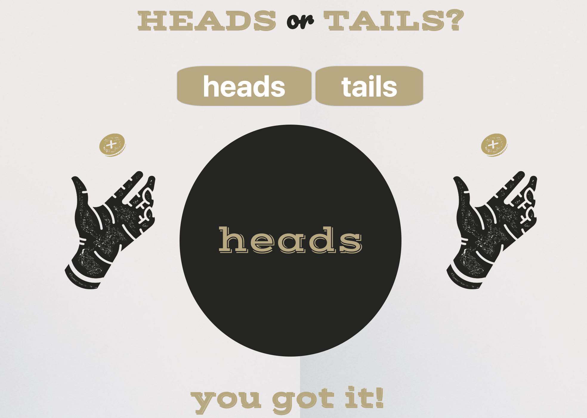

# Node Coin Flip Game
This application allows to guess 'heads' or 'tails' by clicking either button. If the player guesses heads by clicking on the button, the coin will reveal whether or not the coin is landed on the side they chose.

## How it's made:
**Tech Used** I used HTML, CSS and JavaScript and Node.js 
